# Museums Data Analysis

## About

This project seeks to mainly practice SQL on a database about famous paintings and their artists.

## Purposes Of The Project

The major aim of thie project is to gain experience on data analysis, and practice the whole data analysis process in SQL.

## Data

The dataset was sourced from the [Famous Paintings Dataset](https://www.kaggle.com/datasets/mexwell/famous-paintings). 

### Analysis

1. Data collection

>  Gather all the data for analysis.

2. Data cleaning

> Once we have collected the data we need, we need to prepare it for analysis. We need to do this to ensure that the data we are working with is of quality.

3. Data analysis

> This is the part I'll use SQL to answer business questions and show results.

## Business Questions To Answer

1. Are there museums without any paintings?
2. Identify the museums which are open on both Sunday and Monday. Display museum name, city.
3. How many museums are open every single day?
4. Which are the top 5 most popular museum? (Popularity is defined based on most no of paintings in a museum)
5. Who are the top 5 most popular artist? (Popularity is defined based on most no of paintings done by an artist)
6. Display the country and the city with most no of museums.
7. Which country has the 5th highest no of paintings?
8. Which are the 3 most popular and 3 least popular painting styles?

## Project

### 1. Data collection

I used python to transform the csv data into tables on a database in SQL. Libraries used: Pandas and sqlalchemy.

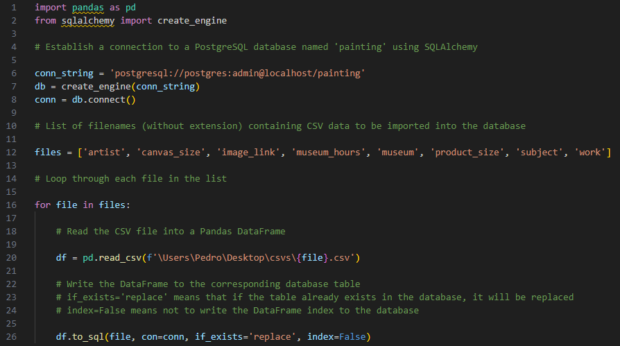

### 2. Data cleaning

For the data cleaning i started looking for duplicate records, and i found a lot of duplicates on the work, product_size, subject and image_link tables, so i deleted them:

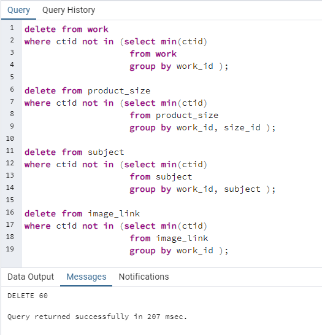

After checking duplicates, i found that some of the cities were wrongly inserted. I deleted all the rows that were found with the 'select' query I used.

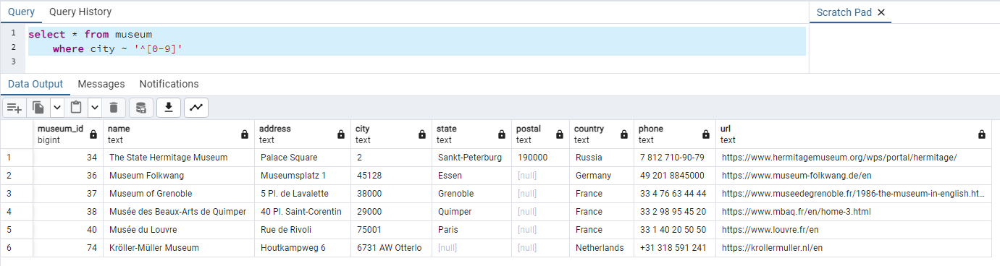

After finally cleaning all the data, it was time for the data analysis phase.

### 3. Data analysis

#### 1. Are there museums without any paintings?

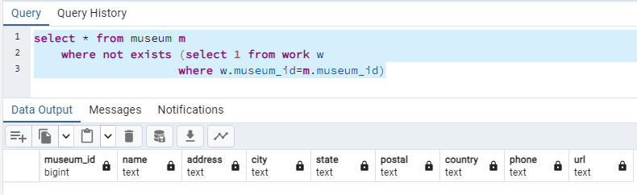

There are no museums without paintings.

#### 2. Identify the museums which are open on both Sunday and Monday. Display museum name, city.

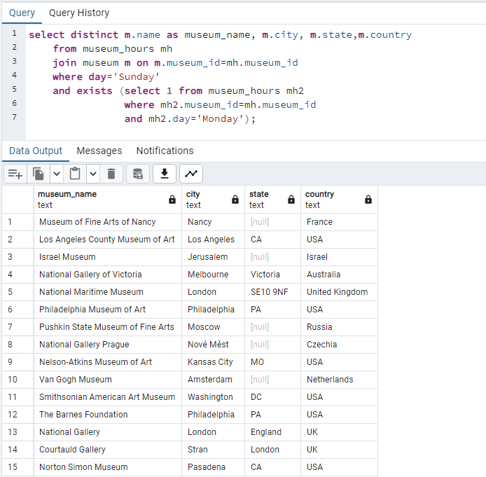

#### 3. How many museums are open every single day?

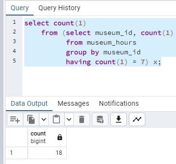

#### 4. Which are the top 5 most popular museum? (Popularity is defined based on most no of paintings in a museum)

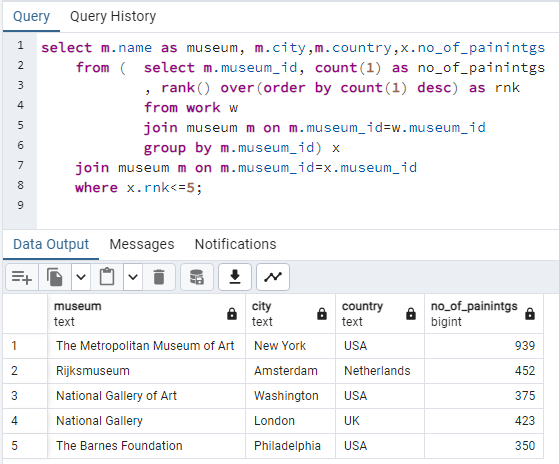

#### 5. Who are the top 5 most popular artist? (Popularity is defined based on most no of paintings done by an artist)

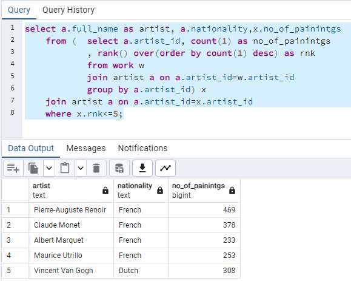

#### 6. Display the country and the city with most no of museums.

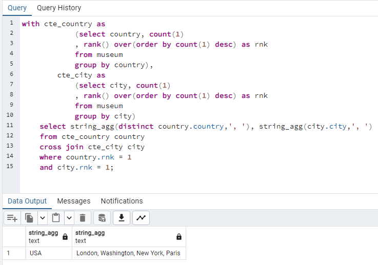

#### 7. Which country has the 5th highest no of paintings?

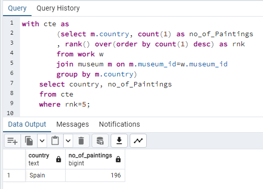

#### 8. Which are the 3 most popular and 3 least popular painting styles?

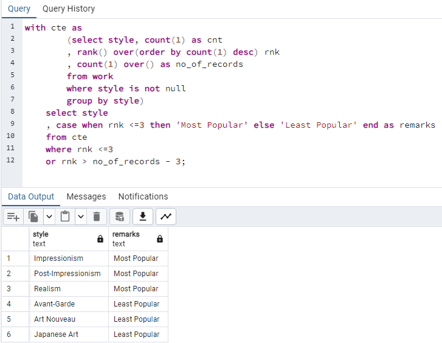

